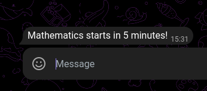
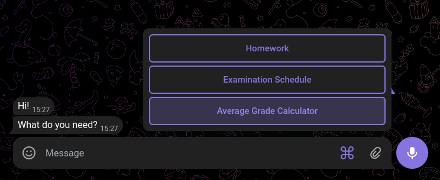
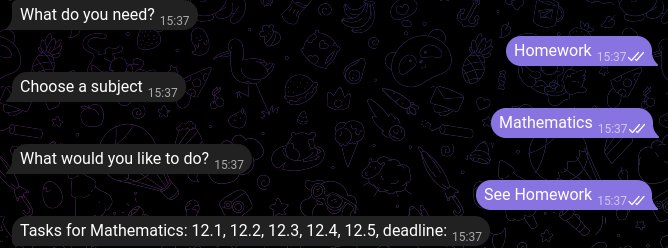
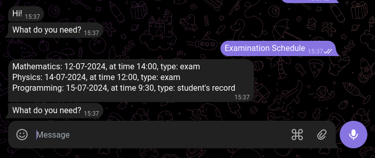
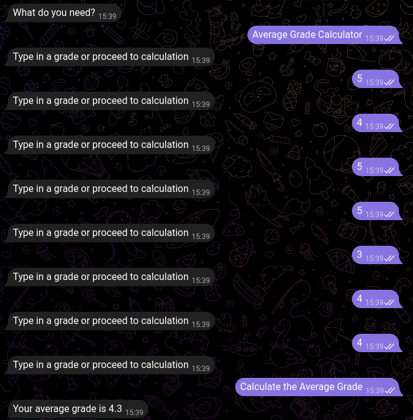

# Student Telegram Bot
## Description
This is a simple Telegram bot dedicated to help students organise their studying routine. 

## Table of Contents
- [Installation](#installation)
- [Usage](#usage)
- [Features](#features)
- [License](#License)
- [Contacts and Contribution](#contacts-and-contribution)

## Installation
1. The project was developed with Python (ver. 3.8+). Download and install [Python](https://www.python.org/downloads/).
2. Clone the [repository](https://github.com/dakorot/Student-Telegram-Bot.git).
3. Install [telebot](https://pypi.org/project/pyTelegramBotAPI/) library.
   ``` bash
   pip install pyTelegramBotAPI
4. Install [schedule](https://schedule.readthedocs.io/en/stable/) library.
   ``` bash
   pip install schedule
5. You are ready to go!

## Usage
The last thing to do is to run the [main.py](main.py) file.

You can also host the bot on a platform of your choice.

## Features
### Automatic Notification System
The bot will send notifications to all the chats 5 minutes before an upcoming class based on the dictionary in the code. The chat IDs are stored in an SQLite database. Running of schedule with no intervening into the main set of functions is solved by a separate thread specifically for notifications.



### Homework 
The user is suggested to choose from the main menu one of three options: Homework, Examination Schedule and Average Grade Calculator.


The user can view, add and delete homework. 


### Examinations
The user can view the examinations schedule which is also stored in the code.


### Average Grade Calculator 
Some students may be interested in calculating their average grades before public ratings are published. The Student Bot suggests a convenient tool for that. The user just keeps typing in their grades and finishes by pushing a dedicated button.



## License
This project is licensed under the MIT License. See the [LICENSE](LICENSE) file for details.

## Contacts and Contribution
Any contributions and ideas are very much welcome!

I can be reached any time via [koropenko.daria@gmail.com](mailto:koropenko.daria@gmail.com)

Enjoy Student Telegram Bot!